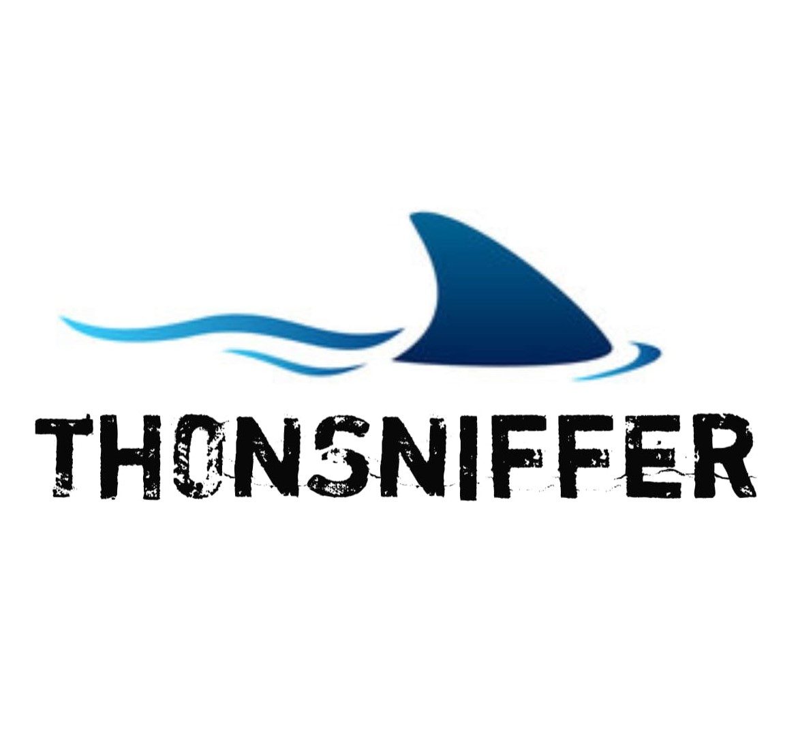

# th0nSniffer
th0nSniffer For EXE Adalah Tool Yang Dirancang Untuk Monitoring Jaringan Dengan Mudah!
Dan Tool Ini Berjalan Pada OS Windows, Ini Adalah Alat Alternatif Lain Selain Wirehshark,
Tool Ini Cocok Untuk Pemula Karena MemFilter Packet Nya Mudah, Selain Itu Tool Ini Tidak Membeban
Seperti Software Pada Umum Nya Yang Selalu Update! Jadilah Shark Dilautan Data Yang Tidak Aman.

📸LOGO TH0NSNIFF

 
🎥 DEMO GIF

Jangan Lupa Start Program.exe Dengan Run As Administrator!

PASSWORD TOOL : th0n

Gunakanlah dengan bijak segala pencurian data dalam jaringan diluar tanggungjawab kami.
Happy Hacking:)

